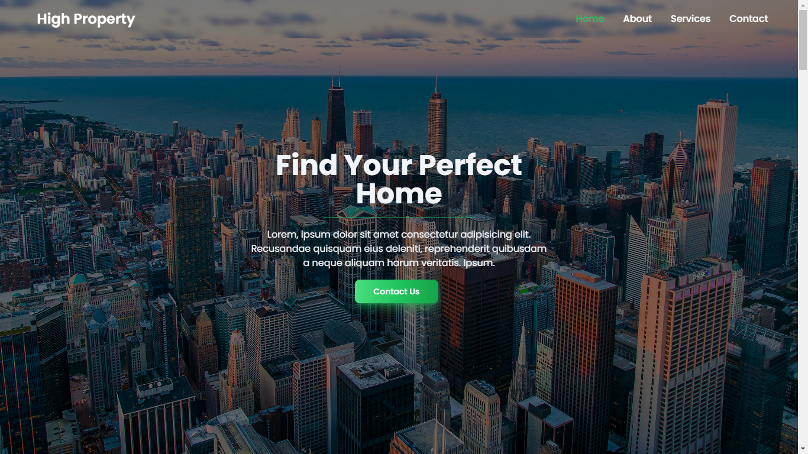

# Company Profile Website Template - HTML5 and TailwindCSS


Free template for Company Profile made using HTML5 and TailwindCSS!  
It is a fully responsive template which you can use for your company or maybe for your own portfolio website.

🌐 Demo Site: https://highproperty.vercel.app/

## Website Features 💻

- Fully responsive design
- Built with HTML5 and TailwindCSS for modern and clean UI
- Flowbite components for enhanced UI elements
- SEO friendly
- Includes basic class profile structure: Home, About, Services, and Contact

## Installation ⚙️

- Clone the repository

```
git clone https://github.com/alanzagi/highproperty-companyprofile.git
```

- Navigate to the Project Directory

```
cd highproperty-companyprofile
```

### ❗ if you want to use `Submit a Form to Google Sheets` function, follow these steps below ❗
1. Create a new Google Sheet

- First, go to [Google Sheets](https://docs.google.com/spreadsheets) and `Start a new spreadsheet` with the `Blank` template.
- Rename it `Email Subscribers`. Or whatever, it doesn't matter.
- Put the following headers into the first row:

|   |     A     |   B   | C | ... |
|---|:---------:|:-----:|:-:|:---:|
| 1 | timestamp | email |   |     |

2. Create a Google Apps Script

- Click on `Tools > Script Editor…` which should open a new tab.
- Rename it `Submit Form to Google Sheets`. _Make sure to wait for it to actually save and update the title before editing the script._
- Now, delete the `function myFunction() {}` block within the `Code.gs` tab.
- Paste the following script in it's place and `File > Save`:
```js
var sheetName = 'Sheet1'
var scriptProp = PropertiesService.getScriptProperties()

function intialSetup () {
  var activeSpreadsheet = SpreadsheetApp.getActiveSpreadsheet()
  scriptProp.setProperty('key', activeSpreadsheet.getId())
}

function doPost (e) {
  var lock = LockService.getScriptLock()
  lock.tryLock(10000)

  try {
    var doc = SpreadsheetApp.openById(scriptProp.getProperty('key'))
    var sheet = doc.getSheetByName(sheetName)

    var headers = sheet.getRange(1, 1, 1, sheet.getLastColumn()).getValues()[0]
    var nextRow = sheet.getLastRow() + 1

    var newRow = headers.map(function(header) {
      return header === 'timestamp' ? new Date() : e.parameter[header]
    })

    sheet.getRange(nextRow, 1, 1, newRow.length).setValues([newRow])

    return ContentService
      .createTextOutput(JSON.stringify({ 'result': 'success', 'row': nextRow }))
      .setMimeType(ContentService.MimeType.JSON)
  }

  catch (e) {
    return ContentService
      .createTextOutput(JSON.stringify({ 'result': 'error', 'error': e }))
      .setMimeType(ContentService.MimeType.JSON)
  }

  finally {
    lock.releaseLock()
  }
}
```

3. Run the setup function

- Next, go to `Run > Run Function > initialSetup` to run this function.
- In the `Authorization Required` dialog, click on `Review Permissions`.
- Sign in or pick the Google account associated with this projects.
- You should see a dialog that says `Hi {Your Name}`, `Submit Form to Google Sheets wants to`...
- Click `Allow`

4. Add a new project trigger 
- Click on `Edit > Current project’s triggers`. 
- In the dialog click `No triggers set up. Click here to add one now.` 
- In the dropdowns select `doPost`
- Set the events fields to `From spreadsheet` and `On form submit`
- Then click `Save`

5. Publish the project as a web app

- Click on `Publish > Deploy as web app…`.
- Set `Project Version` to `New` and put `initial version` in the input field below.
- Leave `Execute the app as:` set to `Me(your@address.com)`.
- For `Who has access to the app:` select `Anyone, even anonymous`.
- Click `Deploy`.
- In the popup, copy the `Current web app URL` from the dialog.
- And click `OK`.

6. Open the file named `js/script.js`. replace `scriptURL` with your `Current web app URL`:
```js
const scriptURL = "paste yours here";
```
and then the code would become like these
```js
const scriptURL = "https://script.google.com/macros/s/AKfycbzWmtYtXzNb8UfFd8anfTHxaJHNI_VbZc81-sIzZ1Uv-GxsBXmQZcESKSzv9xbcz4dT/exec";
```

7. So you can use the Contact Us feature, you have to change the value of variable on the file named `js/script.js` to the company/destination number
```js
const phoneNumber = "6281521550913"
```

- Finished  

## Contributing 🤝

Contributions are what make the open source community such an amazing place to learn, inspire, and create. Any contributions you make are **greatly appreciated**.

1. Fork this Repository
2. Create your Feature Branch (`git checkout -b feature/AmazingFeature`)
3. Commit your Changes (`git commit -m 'Add some AmazingFeature'`)
4. Push to the Branch (`git push origin feature/AmazingFeature`)
5. Open a Pull Request

## Support Me ❤️

Here to support me on [Trakteer](https://trakteer.id/alan_zagi)  
You can start supporting by buying me an ice cream 🍦  
start from Rp10.000 / 0.64 USD. Thank you very much! 🙏

## Business inquiries 💼

If you need my services, like deployment this website to online or etc,  
you can start talk to me for business cooperation.  
Click [This Link](https://linktr.ee/alanzagi) for start message me.

## Resources Used 🛠️

1. [Tailwind CSS v3.4.13](https://tailwindcss.com/docs/installation)
2. [Flowbite v2.5.2](https://flowbite.com/docs/getting-started/introduction/)
3. [DataAOS for Scroll Animation](https://github.com/michalsnik/aos)
4. [Jamie Wilson Form To Google Sheet](https://github.com/jamiewilson/form-to-google-sheets)

## License ©️

[MIT license](https://opensource.org/licenses/MIT).
